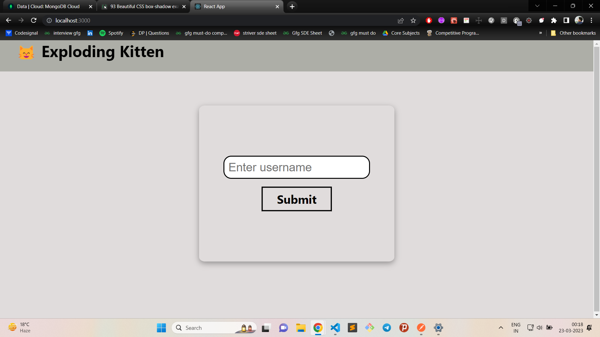
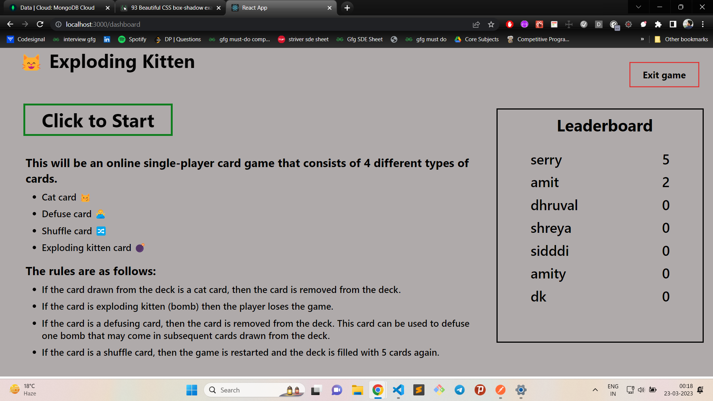
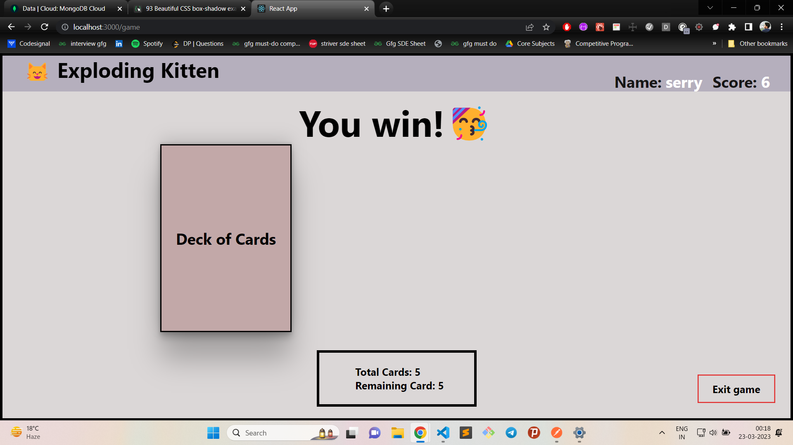
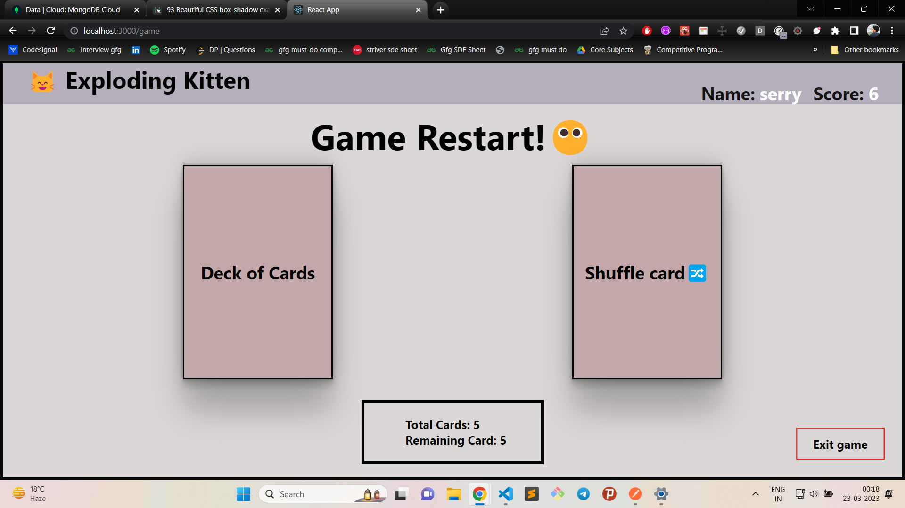
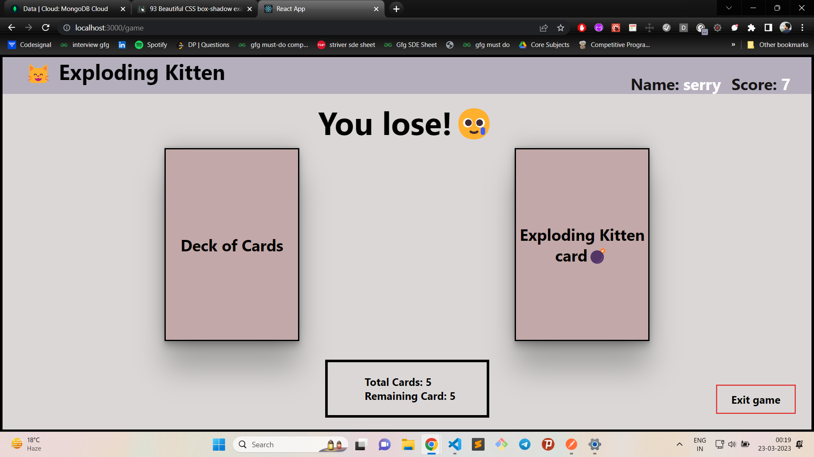

# **************** Emitrr Assignment ****************

## For Running code follow given commands

<h3>For backend server:<h3>
cd backend 
npm i 
npm start 

  
<h3>For frontend server:<h3>
cd Frontend 
npm i 
npm start 

# These are some my project screenshots

